# 📋 CSV Deduplicador por Chaves Compostas

Ferramenta em Go para remoção de duplicatas em arquivos CSV baseado em colunas-chave configuráveis.


## ✨ Funcionalidades
- **Remoção de Duplicatas**: Elimina registros repetidos por combinação de colunas
- **Configuração Flexível**: Define chaves via variáveis de ambiente
- **Case-insensitive**: Identifica colunas independente de maiúsculas/minúsculas
- **Saída Estruturada**: Gera arquivo em pasta dedicada (`data/`)
- **Resiliência a Erros**: Validações de arquivo e estrutura

## ⚡ Pré-requisitos
- Go 1.16+
- Arquivo CSV com cabeçalho

## 🛠 Instalação
```bash
git clone https://github.com/samuelrms/deduplicate-rows-csv.git
cd csv-deduplicator
go build -o deduplicador
```

## 🔧 Configuração (Variáveis de Ambiente)
| Variável       | Descrição                          | Padrão     |
|----------------|------------------------------------|------------|
| `INPUT_NAME`   | Nome do arquivo de entrada         | dados.csv  |
| `OUTPUT_NAME`  | Nome do arquivo de saída           | dedup.csv  |
| `KEYS`         | Colunas-chave (separadas por vírgula) | empresa,moeda |

## 🚀 Uso Básico
```bash
# Usando padrões (docs/dados.csv → data/dedup.csv)
./deduplicador

# Customizando (Linux/Mac)
export KEYS="codigo,data"
export INPUT_NAME=entrada.csv
export OUTPUT_NAME=saida_limpa.csv
./deduplicador

# Customizando (Windows PowerShell)
$env:KEYS = "nome,cpf"
$env:INPUT_NAME = "clientes.csv"
./deduplicador
```

## 🔄 Fluxo de Processamento (Mermaid)

```mermaid
graph TD
    A[Início] --> B[Ler Variáveis de Ambiente]
    B --> C{Arquivo Existe?}
    C -->|Sim| D[Ler Cabeçalho]
    C -->|Não| E[Erro]
    D --> F{Chaves Válidas?}
    F -->|Sim| G[Processar Linhas]
    F -->|Não| H[Erro]
    G --> I{Chave Já Vista?}
    I -->|Não| J[Escrever Linha]
    I -->|Sim| K[Pular]
    J --> L{Próxima Linha}
    L -->|Sim| G
    L -->|Não| M[Gerar Saída]
```


## 📌 Exemplo Prático
**Arquivo de Entrada (`docs/dados.csv`)**:
```csv
empresa,moeda,valor
Alpha,BRL,150
Beta,USD,200
Alpha,BRL,150
Gamma,EUR,300
```

**Execução**:
```bash
export KEYS="empresa,moeda"
./deduplicador
```

**Saída (`data/dedup.csv`)**:
```csv
empresa,moeda,valor
Alpha,BRL,150
Beta,USD,200
Gamma,EUR,300
```

## 🛑 Tratamento de Erros Comuns
**Arquivo de Entrada Não Encontrado**  
```log
Erro ao abrir docs/dados.csv: O sistema não pode encontrar o arquivo especificado.
```
- Verifique se o arquivo existe na pasta `docs/`
- Confira o nome no `INPUT_NAME`

**Coluna-chave Inexistente**  
```log
Coluna-chave 'cpf' não encontrada no header
```
- Liste as colunas disponíveis com `head -1 docs/dados.csv`
- Ajuste a variável `KEYS`

**Permissão Negada**  
```log
Não consegui criar pasta data: mkdir data: permissão negada
```
- Execute com `sudo` (Linux/Mac)
- Libere permissões na pasta

## 🔄 Personalização
**Múltiplas Chaves**  
Combine até 5 colunas:
```bash
export KEYS="regiao,ano,tipo"
```

**Case Sensitivity**  
Para comparação exata (case-sensitive), modifique no código:
```go
// Alterar:
strings.EqualFold(col, kn) → col == kn
```

**Delimitador Composto**  
Mude o separador das chaves (padrão `|`):
```go
// Alterar:
strings.Join(parts, "|") → strings.Join(parts, "#")
```

## 📄 Licença
MIT License - Consulte [LICENÇA](LICENSE) para detalhes.

---

**Nota**: Otimizado para CSVs grandes (testado com 1M+ registros). Para arquivos maiores que 500MB, considere aumentar a memória alocada.