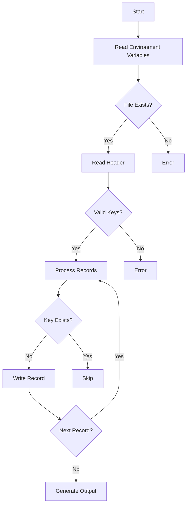

# 📋 CSV Deduplicator by Composite Keys

Go-based tool for removing duplicates in CSV files using configurable key columns.


## ✨ Key Features
- **Duplicate Removal**: Eliminates duplicate records using composite keys
- **Flexible Configuration**: Define keys via environment variables
- **Case-Insensitive Matching**: Column identification regardless of case
- **Structured Output**: Generates files in dedicated `data/` directory
- **Robust Error Handling**: Comprehensive file and structure validation

## ⚡ Prerequisites
- Go 1.16+
- CSV file with header row

## 🛠 Installation
```bash
git clone https://github.com/samuelrms/deduplicate-rows-csv.git
cd csv-deduplicator
go build -o deduplicator
```

## 🔧 Configuration (Environment Variables)
| Variable       | Description                      | Default     |
|----------------|----------------------------------|-------------|
| `INPUT_NAME`   | Input filename                   | data.csv    |
| `OUTPUT_NAME`  | Output filename                  | dedup.csv   |
| `KEYS`         | Key columns (comma-separated)    | company,currency |

## 🚀 Basic Usage
```bash
# Use defaults (docs/data.csv → data/dedup.csv)
./deduplicator

# Custom configuration (Linux/Mac)
export KEYS="code,date"
export INPUT_NAME=input.csv
export OUTPUT_NAME=cleaned_data.csv
./deduplicator

# Custom configuration (Windows PowerShell)
$env:KEYS = "name,id"
$env:INPUT_NAME = "customers.csv"
./deduplicator
```

## 🔄 Processing Workflow (Mermaid)


## 📌 Practical Example
**Input File (`docs/data.csv`)**:
```csv
company,currency,value
Alpha,USD,150
Beta,EUR,200
Alpha,USD,150
Gamma,GBP,300
```

**Execution**:
```bash
export KEYS="company,currency"
./deduplicator
```

**Output (`data/dedup.csv`)**:
```csv
company,currency,value
Alpha,USD,150
Beta,EUR,200
Gamma,GBP,300
```

## 🛑 Common Error Handling
**Input File Not Found**  
```log
Error opening docs/data.csv: no such file or directory
```
- Verify file exists in `docs/` directory
- Check `INPUT_NAME` value

**Invalid Key Column**  
```log
Key column 'phone' not found in header
```
- List available columns: `head -1 docs/data.csv`
- Adjust `KEYS` environment variable

**Permission Denied**  
```log
Could not create directory data: permission denied
```
- Run with `sudo` (Linux/Mac)
- Adjust directory permissions

## 🔄 Customization Options
**Multiple Key Columns**  
Combine up to 5 columns:
```bash
export KEYS="region,year,type"
```

**Case-Sensitive Matching**  
Modify code for exact matching:
```go
// Change:
strings.EqualFold(col, kn) → col == kn
```

**Custom Key Separator**  
Change composite key delimiter (default `|`):
```go
// Change:
strings.Join(parts, "|") → strings.Join(parts, "#")
```

## 📄 License
MIT License - See [LICENSE](LICENSE) for details.

---

**Note**: Optimized for large CSVs (tested with 1M+ records). For files exceeding 500MB, consider increasing allocated memory.